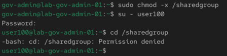
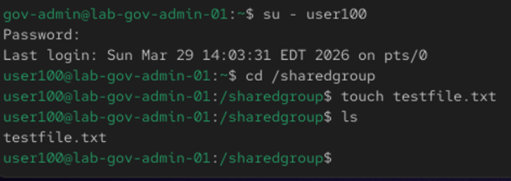

# Day 1 - Users & Groups Lab

## Objective

- Create users and groups 
- Set permissions for /sharedgroup

## Broken / Issue

- Users missing 
- Groups missing
- Permissions incorrect

## Fix:

- Created users, added to groups
- Set permissions for /sharedgroup

### Commands:

1. Created Users:
useradd user100
useradd user200
useradd user300
useradd user400
useradd user500

2. Created group:
groupadd Alpha
groupadd Beta

3. Added users to groups:
usermod -aG Alpha user100
usermod -aG Alpha user200
usermod -aG Alpha user300
usermod -aG Beta user400
usermod -aG Beta user500

4. Created shared directory and set permissions:
mkdir /sharedgroup
chown :Alpha /sharedgroup
chmod 2770 /sharedgroup

## Verifcation

### Commands:

id user100
ls -ld /sharedgroup

## Screenshots

 
