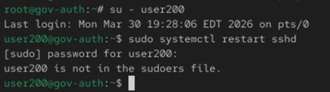
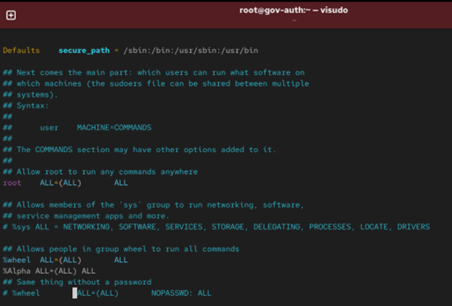
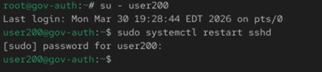

# Day 2 - Sudo Access 

## Objective
- Grant sudo access to user200
- Validate sudo access

# Broken State
su - user200
sudo systemctl restart sshd

# Fix
su -
usermod -aG wheel user200
visudo
[ensure]    %wheel ALL=(ALL) ALL

# Verification
su - user200
sudo systemctl restart sshd

## Screenshots

