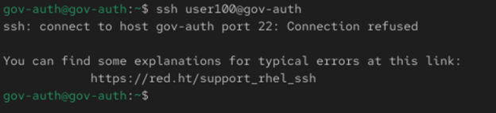
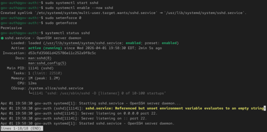
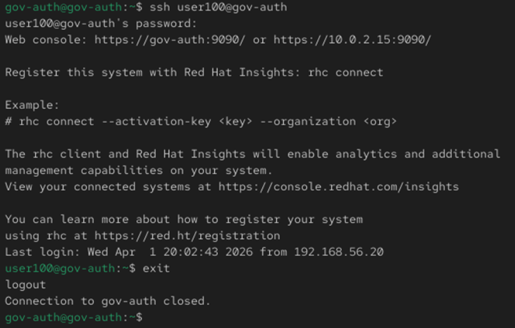

# Day 3 - SSH Service & SELinux Check

## Objectives:

- Enable SSH service
- Temporarily disable SELinux
- Verify SSH Login

## Broken 

- SSHD stopped
- SELinux enforcing
- SSH login fails

### Commands:

sudo systemctl stop sshd

ssh user200@localhost

getenforce

## Fix

- SSH enabled and running
- SELinux permissive
- SSH login succeeds

### Commands:

sudo systemctl enable --now sshd

sudo setenforce 0

## Verification

### Commands:

ssh user200@gov-auth

## Screenshots

- Broken State

- Fixed State

- Verification

