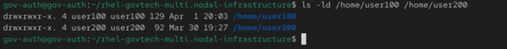
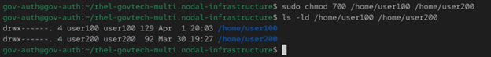
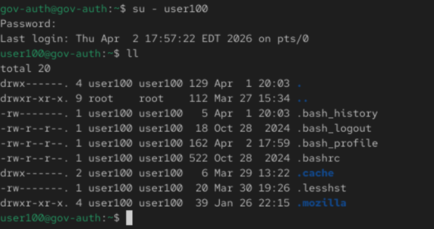

# Day 4 - Home Directories & Environment

## Objectives
 
- Secure home directories
- Configure user environment

## Broken State 

### Commands:

ls -ld /home/user100 /home/user200

## Fix

### Commands:

sudo chmod 700 /home/user100 /home/user200
echo "alias ll='ls -la'" | sudo tee -a /home/user100/.bash_profile
sudo chown user100:user200 /home/user100/.bash_profile

## Verification

### Commands;

su - user100
ll

